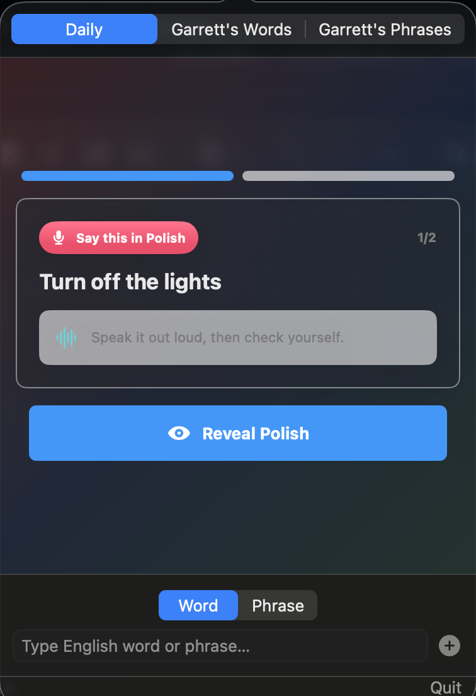
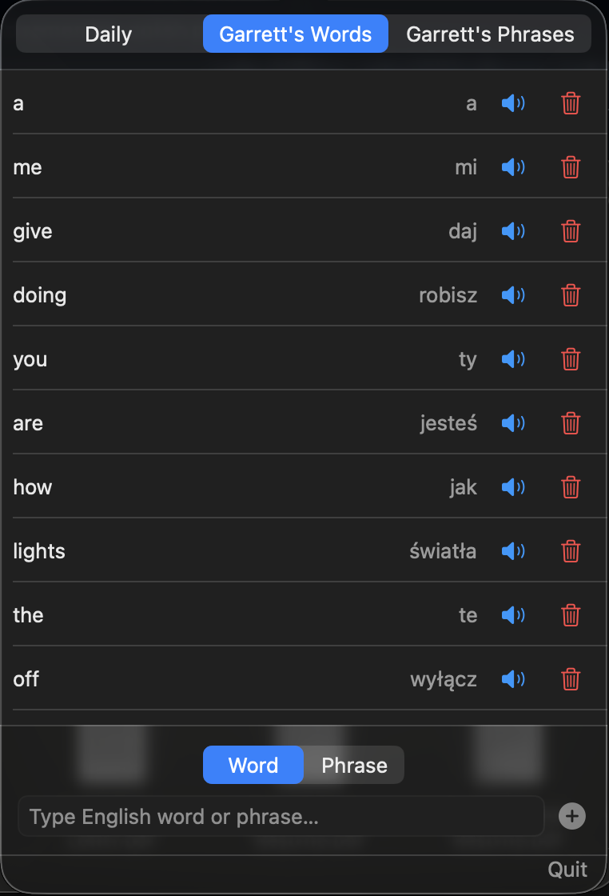
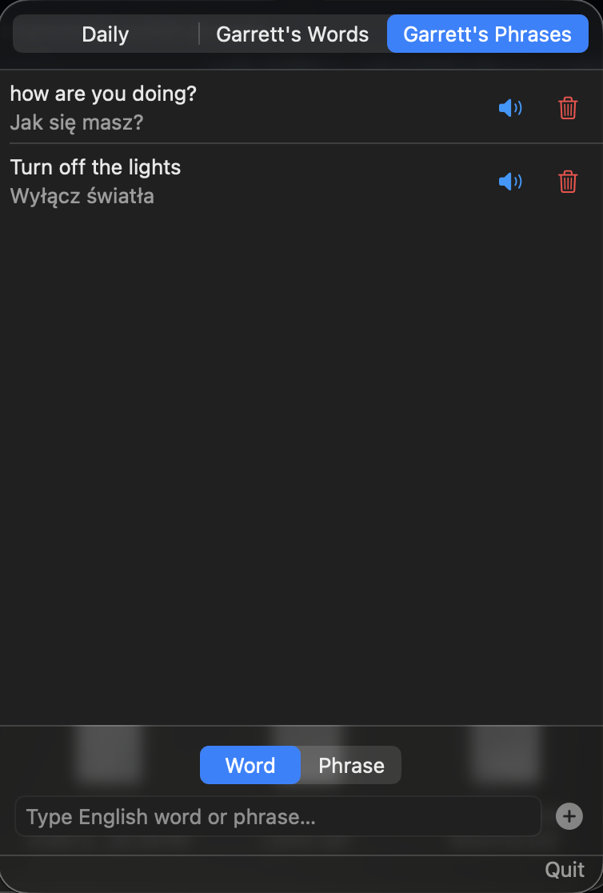

# MyPolishEncyclopedia

A small macOS SwiftUI app for building a personal English-to-Polish word and phrase bank.

## Screenshots

| Daily drill | Words | Phrases |
| --- | --- | --- |
|  |  |  |

## Features

- Add English words or phrases and translate them into Polish with Claude.
- Save words and phrases in separate tabs.
- Break phrases into individual vocabulary words automatically.
- Play Polish pronunciation audio with ElevenLabs.
- Practice phrases with a daily speaking drill and self-grade each answer.
- Store entries locally as JSON on your Mac.

## Setup

1. Open `MyPolishEncyclopedia.xcodeproj` in Xcode.
2. Copy `MyPolishEncyclopedia/App/APIConfig.swift.example` to `MyPolishEncyclopedia/App/APIConfig.swift`.
3. Add your API keys.
4. Build and run the macOS app.

## API Keys

`APIConfig.swift` is gitignored. It should define:

- `claudeAPIKey` and `claudeModel` for translation.
- `elevenLabsAPIKey` and `elevenLabsVoiceID` for pronunciation audio.

## Local Data

Entries are saved locally in Application Support under `MyPolishEncyclopedia/entries.json`. Audio can be cached with saved entries.
